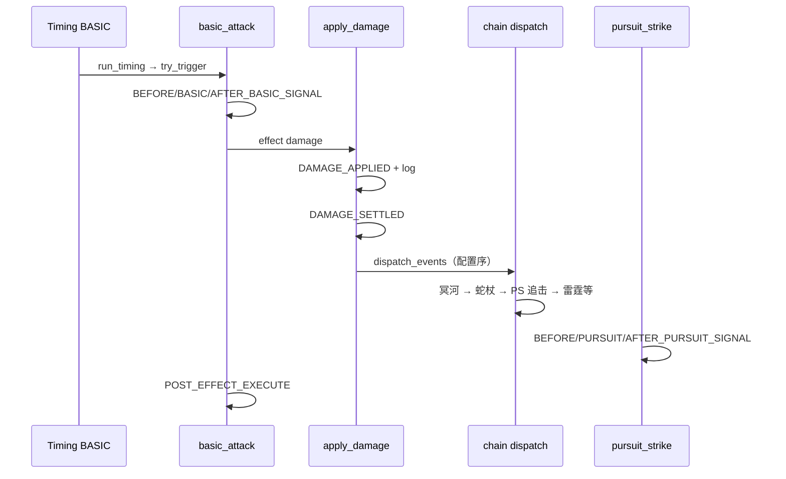
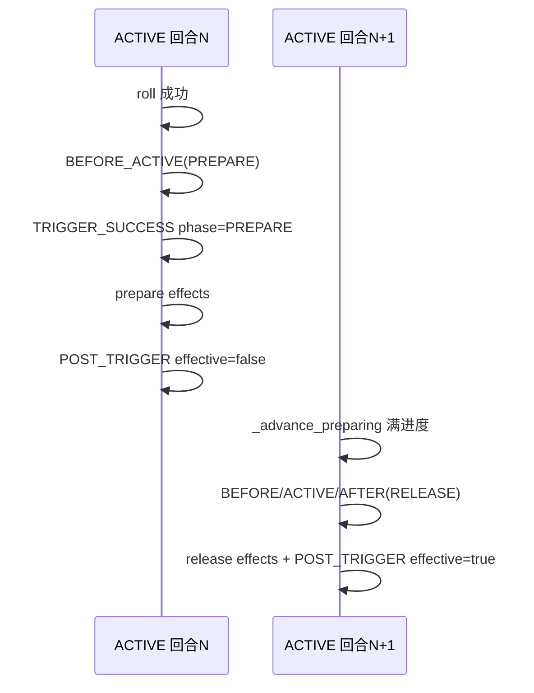

# BattleCore 事件与信号触发表

> **维护约定**：本文档与 `battlecore/domain/enums.py`（`EventType` / `Timing`）、`battlecore/engine/battle_context.py`（发射与派发逻辑）保持同步。修改事件协议时须同步更新本文档。
>
> 设计总纲见 [DESIGN_V2.md](./DESIGN_V2.md)；State 响应见 [STATE_RESPONSE_REFERENCE.md](./STATE_RESPONSE_REFERENCE.md)。

---

## 一、事件模型是做什么的

BattleCore 采用 **事件驱动（Event-Driven）** 架构：战斗内每一次有意义的阶段变化、判定、结算，都会生成一条 `BattleEvent` 写入 `event_stream`，并可选地进入 `event_queue` 等待派发。

**设计目的：**

1. **可回放 / 可审计**：同一 `seed` + 同一输入 → 同一事件序列 → 同一战斗结果。
2. **解耦技能逻辑**：复杂连锁（受伤后治疗、受伤后落雷、普攻后追击）不硬编码在主循环里，而是通过「发射事件 → 监听方响应」完成。
3. **区分语义层次**：Timing（时间片）、Trigger 判定、战法 Signal（发动阶段）、Effect 执行、Applied/Settled 结算，各用不同事件类型表达，避免混用。

### 1.1 三个容易混淆的概念


| 概念               | 是什么                                              | 典型用途                                |
| ---------------- | ------------------------------------------------ | ----------------------------------- |
| **Timing**       | 战斗主循环的**时间片**（如 `BASIC`、`ACTIVE`），不是 `EventType` | 决定「此刻轮到谁、检查哪些 Skill/State」          |
| **Event（事件）**    | `EventType` 枚举值 + `BattleEvent` 实例               | 审计、回放、SPY 状态订阅、测试断言                 |
| **Signal（战法信号）** | 事件的一个**子集**，名称为 `*_SIGNAL`                       | 专供「战法发动前/时/后」连锁监听；规则失败或概率失败时**不发射** |


### 1.2 派发机制 `dispatch_events`

```text
emit_event(...)  →  event_stream 追加 + event_queue 入队
dispatch_events():
    while event_queue 非空:
        取出 event
        收集 spy_state_event_index[event.event_type] 中仍有效的 SPY 状态
        should_trigger_by_event 过滤
        sort_spy_states_for_dispatch()  ← 硬配置排序（见 STATE_RESPONSE_REFERENCE.md §七）
        依次 try_trigger_triggerable(state, …)
        若有 chain 组：再处理 kind=SKILL 步骤（如追击）
        可能产生新事件 → 继续循环
    限制: max_events_per_step、max_chain_depth、responded_event_ids 防重复/防死循环
```

**SPY 响应顺序（回放关键）**：

| 情况 | 排序规则 |
|------|----------|
| 该 `event_type` 有 `SpyGroupConfig` | `steps` 中 STATE 步序 → 未匹配步按 `state_unconfigured_sort` |
| 无 SPY 组 | 全部 SPY 按 `ConfigDB.state_unconfigured_sort`（默认：持有者 `position` → `owner_id` → `state_instance_id`） |
| `kind=SKILL` 连锁步 | 所有 STATE 处理完后执行（如 PURSUIT） |

`spy_state_event_index` 仅用于**候选收集**，**不再**决定最终触发顺序（与 `rebuild_indexes` 注册序无关）。

**要点：**

- **Timing 驱动**：Skill / REGULAR 状态在 `run_timing(timing, actor)` 里按配置顺序触发。
- **Event 驱动**：SPY 状态在 `dispatch_events()` 里响应已发射事件。
- **每个 effect 执行完会 `dispatch_events()`**，因此多段技能中间可插入 SPY 连锁（如戈耳工凝视两段伤害之间触发蛇杖/雷霆）。
- **战法 Signal 发射后会立即 `dispatch_events()`**，便于「发动前/时/后」被动在信号当下响应。

### 1.3 触发流水线（Skill / SPY State 共用）

一次成功的 Skill/State 触发，典型事件序列为：

```text
PRE_TRIGGER_CHECK          → allowed=true/false
  ├─ 规则失败 → TRIGGER_FAIL (failure_kind=RULE|CONTROL)，结束，无 Signal
  └─ 概率失败 → TRIGGER_FAIL (failure_kind=PROBABILITY)，结束，无 Signal
TRIGGER_SUCCESS            → 含 roll_bps / pseudo_random_key 等（审计）
  [Skill only]
BEFORE_*_SIGNAL            → phase=BEFORE；准备型可有 trigger_phase=PREPARE|RELEASE
*_SIGNAL (ON)              → phase=ON
  execute_skill / state.execute
    每个 Effect:
      PRE_EFFECT_CHECK → EFFECT_CHECK_* → PRE_EFFECT_EXECUTE
      → apply_damage/heal/state …
      → DAMAGE_APPLIED → log → DAMAGE_SETTLED（伤害每次均发，payload.damage 含 0）
      → dispatch_events()          ← SPY 响应 SETTLED
      → POST_EFFECT_EXECUTE
      → dispatch_events()          ← 队列中余下事件
AFTER_*_SIGNAL             → phase=AFTER
POST_TRIGGER               → effective=true/false；准备型区分 PREPARE/RELEASE
```

### 1.4 Timing / Event / Signal / Applied / Settled 怎么区分

| 层次 | 是什么 | 何时产生 | 典型消费者 | 与下一层的区别 |
|------|--------|----------|------------|----------------|
| **Timing** | 主循环时间片（`BASIC`、`ACTIVE`…） | `run_timing()` 进入/退出 | Skill/State 的 `trigger_timings` 索引 | **不是** `EventType`；只决定「此刻轮到谁检查什么」 |
| **Event** | `BattleEvent` + `EventType`（37 种） | 引擎在判定/结算/状态变化时 `emit_event` | 回放审计、测试断言、SPY 订阅 | 全量事实账本；**包含** Signal，但范围更大 |
| **Signal** | Event 的**子集**，名称为 `*_SIGNAL` | 仅 BASIC/ACTIVE/PURSUIT 战法**触发成功**后 `emit_skill_signal` | 未来「发动前/后」被动（demo 暂无配置化监听） | 规则失败或概率失败时**不发射**；只描述战法发动阶段 |
| **APPLIED** | 结算结果事件（`DAMAGE_APPLIED` / `HEAL_APPLIED`） | `apply_damage` / `apply_heal` 改完兵力/伤兵后 | 战报、回放展示「数值已落地」 | **权威结果**；不打开 SPY 窗口 |
| **SETTLED** | 结算信号事件（`DAMAGE_SETTLED` / `HEAL_SETTLED`） | APPLIED 之后（伤害：**每次 apply 都发**，治疗：仍要求 >0） | SPY 连锁、受击率重算（伤害且 >0） | **连锁窗口**；监听方按 payload 自行过滤 |

**记忆口诀：**

- Timing 驱动「到点检查谁」。
- Event 记录「发生了什么」。
- Signal 只描述「战法发动的前/中/后」。
- Applied = 账本落数；Settled = 通知下游可以连锁。

---

## 二、Timing 时间片（非 EventType，但与触发强相关）


| Timing          | 中文     | 作用域      | 说明                                      |
| --------------- | ------ | -------- | --------------------------------------- |
| `BATTLE_START`  | 战斗开始   | 全局       | 战斗级被动、开局效果                              |
| `HIT_RATE_INIT` | 受击率初始化 | 全局       | PREPARE 之前；快照初始受击点数并归一（见 DESIGN_V2）     |
| `PREPARE`       | 准备阶段   | 全局       | 指挥战法（COMMAND）、开局 Buff                   |
| `ROUND_START`   | 回合开始   | 全局       | 伤兵→死兵 30%、ROUND_START 状态/技能、打印有效四维      |
| `BEFORE_ACTION` | 行动前    | 当前 actor | 状态 duration tick、ACTIVE 状态（如幽影蔽体、冥祭献统）  |
| `ACTIVE`        | 主动战法   | 当前 actor | 主动战法判定；准备型战法进度推进                        |
| `BASIC`         | 普攻     | 当前 actor | 普攻判定；追击也在此 timing 内连锁                   |
| `AFTER_ACTION`  | 行动后    | 当前 actor | 行动后效果（预留）                               |
| `ROUND_END`     | 回合结束   | 全局       | 显式 `duration_tick_mode=ROUND_END` 的状态衰减 |
| `BATTLE_END`    | 战斗结束   | 全局       | 战后收尾                                    |


**全局 Timing**（`actor=None` 时 Skill 仍可触发）：  
`BATTLE_START | HIT_RATE_INIT | PREPARE | ROUND_START | ROUND_END | BATTLE_END`

**单武将行动 Timing 顺序**：`BEFORE_ACTION → ACTIVE → BASIC → AFTER_ACTION`

---

## 三、全量事件触发表

下表列出 `EventType` 全部 37 种事件。  
「类型」列：**生命周期** / **Timing 框** / **触发判定** / **战法信号** / **Effect** / **结算** / **状态** / **武将胜负**。

### 3.1 战斗生命周期


| 事件                | 类型   | 发射时机            | 谁触发 | 主要 payload                                  | 连锁 / 监听                    |
| ----------------- | ---- | --------------- | --- | ------------------------------------------- | -------------------------- |
| `BATTLE_STARTED`  | 生命周期 | `run_battle` 开头 | 引擎  | `config_version`, `seed`                    | 无 SPY；随后 `rebuild_indexes` |
| `BATTLE_FINISHED` | 生命周期 | `run_battle` 末尾 | 引擎  | `result`, `winner_team_id`, `finish_reason` | 战斗已结束                      |


### 3.2 回合与 Timing 框


| 事件               | 类型       | 发射时机                     | 谁触发 | 主要 payload | 连锁 / 监听                      |
| ---------------- | -------- | ------------------------ | --- | ---------- | ---------------------------- |
| `ROUND_STARTED`  | 生命周期     | 每回合行动顺序确定后               | 引擎  | 行动顺序、合并决策  | 随后 `run_timing(ROUND_START)` |
| `ROUND_ENDED`    | 生命周期     | 每回合 `ROUND_END` timing 后 | 引擎  | —          | —                            |
| `TIMING_STARTED` | Timing 框 | 每次 `run_timing` 入口       | 引擎  | —          | 标记 `current_timing`          |
| `TIMING_ENDED`   | Timing 框 | 每次 `run_timing` 出口       | 引擎  | —          | —                            |


### 3.3 触发判定（Triggerable：Skill / State 共用）


| 事件                  | 类型   | 发射时机                            | 谁触发 | 主要 payload                                                                    | 连锁 / 监听                         |
| ------------------- | ---- | ------------------------------- | --- | ----------------------------------------------------------------------------- | ------------------------------- |
| `PRE_TRIGGER_CHECK` | 触发判定 | 每次 `try_trigger_triggerable` 开头 | 引擎  | `allowed`, `reason`                                                           | 规则检查；失败则不发 Signal               |
| `TRIGGER_SUCCESS`   | 触发判定 | 规则+概率通过                         | 引擎  | `roll_bps`, `threshold_bps`, `pseudo_random_key`；准备型含 `phase=PREPARE|RELEASE` | 统计用；**不是**战法阶段 Signal           |
| `TRIGGER_FAIL`      | 触发判定 | 规则或概率失败                         | 引擎  | `reason`, `failure_kind`, `failed_timing`, roll 细节                            | 无 Signal；伪随机 failCount+1        |
| `POST_TRIGGER`      | 触发判定 | 一次触发流水线结束                       | 引擎  | `effective`, `trigger_phase?`                                                 | 准备型 PREPARE 段 `effective=false` |


`**TRIGGER_FAIL` 常见 reason：**


| reason                                                                      | 含义                               |
| --------------------------------------------------------------------------- | -------------------------------- |
| `TIMING_NOT_MATCH`                                                          | 当前 timing 不在 trigger_timings 内   |
| `OWNER_EXITED`                                                              | 持有者已退出                           |
| `ROUND_NOT_VALID` / `COOLDOWN` / `MAX_TRIGGER_*`                            | 回合/冷却/次数限制                       |
| `CONTROL_FORBID_ACTIVE` / `CONTROL_FORBID_BASIC` / `CONTROL_FORBID_PURSUIT` | 控制状态禁止                           |
| `ACTIVE_PREPARING`                                                          | 准备型战法已在吟诵中                       |
| `PURSUIT_REQUIRES_BASIC_DAMAGE_SETTLED`                                     | 追击要求普攻 DAMAGE_SETTLED 且 damage>0 |
| 概率失败                                                                        | `failure_kind=PROBABILITY`       |


### 3.4 战法信号（Signal）— 仅 BASIC / ACTIVE / PURSUIT

**规则：只有 `SkillCategory` 为 BASIC / ACTIVE / PURSUIT 且触发成功时，才通过 `emit_skill_signal` 发射。**  
COMMAND / PASSIVE 技能**不**发射 Signal（走 Timing 触发 + Effect，无 `BEFORE_*_SIGNAL`）。


| 事件                      | 类型   | 对应 phase | 技能类别    | 发射时机              | payload 要点                                                         |
| ----------------------- | ---- | -------- | ------- | ----------------- | ------------------------------------------------------------------ |
| `BEFORE_BASIC_SIGNAL`   | 战法信号 | BEFORE   | BASIC   | 普攻概率成功后、execute 前 | `phase`, `skill_category`, `skill_instance_id`, `source_event_id?` |
| `BASIC_SIGNAL`          | 战法信号 | ON       | BASIC   | execute_skill 前   | 同上                                                                 |
| `AFTER_BASIC_SIGNAL`    | 战法信号 | AFTER    | BASIC   | execute_skill 后   | 同上                                                                 |
| `BEFORE_ACTIVE_SIGNAL`  | 战法信号 | BEFORE   | ACTIVE  | 主动战法成功后、execute 前 | 准备型：`trigger_phase=PREPARE`（进入准备）或 `RELEASE`（释放）                   |
| `ACTIVE_SIGNAL`         | 战法信号 | ON       | ACTIVE  | execute 前         | **进入准备段不发**；仅 RELEASE 或即时战法发                                       |
| `AFTER_ACTIVE_SIGNAL`   | 战法信号 | AFTER    | ACTIVE  | execute 后         | 同上                                                                 |
| `BEFORE_PURSUIT_SIGNAL` | 战法信号 | BEFORE   | PURSUIT | 追击成功后、execute 前   | 普攻 DAMAGE_SETTLED 后连锁；timing 仍为 BASIC                              |
| `PURSUIT_SIGNAL`        | 战法信号 | ON       | PURSUIT | execute 前         | 同上                                                                 |
| `AFTER_PURSUIT_SIGNAL`  | 战法信号 | AFTER    | PURSUIT | execute 后         | 同上                                                                 |


**准备型主动战法 Signal 分段：**


| 阶段         | 发射的 Signal                                                                                       | 不发射                                   |
| ---------- | ------------------------------------------------------------------------------------------------ | ------------------------------------- |
| 进入准备（概率成功） | `BEFORE_ACTIVE_SIGNAL`(PREPARE)、`TRIGGER_SUCCESS`(phase=PREPARE)、`POST_TRIGGER`(effective=false) | `ACTIVE_SIGNAL`、`AFTER_ACTIVE_SIGNAL` |
| 释放（吟诵满）    | 完整 BEFORE → ON → AFTER（trigger_phase=RELEASE）                                                    | —                                     |


**即时主动战法 Signal 顺序：**  
`BEFORE_ACTIVE → TRIGGER_SUCCESS → ACTIVE → [effects] → AFTER_ACTIVE → POST_TRIGGER(effective=true)`

### 3.5 Effect 执行


| 事件                     | 类型     | 发射时机                | 谁触发 | 主要 payload                      | 连锁 / 监听               |
| ---------------------- | ------ | ------------------- | --- | ------------------------------- | --------------------- |
| `TARGET_SELECTED`      | Effect | `select_targets` 完成 | 引擎  | `target_policy`, `target_count` | 目标选择审计                |
| `PRE_EFFECT_CHECK`     | Effect | 每个 effect 执行前       | 引擎  | effect 概率检查上下文                  | —                     |
| `EFFECT_CHECK_SUCCESS` | Effect | effect 概率通过         | 引擎  | roll 细节                         | —                     |
| `EFFECT_CHECK_FAIL`    | Effect | effect 概率/目标失败      | 引擎  | `reason`                        | 跳过 execute            |
| `PRE_EFFECT_EXECUTE`   | Effect | effect 即将执行         | 引擎  | skill_id, effect_id, targets    | —                     |
| `POST_EFFECT_EXECUTE`  | Effect | 单个 effect 执行完毕      | 引擎  | skill_id, effect_id, targets    | 队列余下事件；追击已改由 DAMAGE_SETTLED 连锁配置触发 |


### 3.6 伤害 / 治疗结算


| 事件               | 类型    | 发射时机                           | 谁触发 | 主要 payload                                          | 连锁 / 监听                   |
| ---------------- | ----- | ------------------------------ | --- | --------------------------------------------------- | ------------------------- |
| `DAMAGE_APPLIED` | 结算·结果 | `apply_damage` 改兵力后（含 damage=0） | 引擎  | `damage`, `old/new_troops`, `dead`, `wounded`, 暴击字段 | **战报权威**；兵力已写入           |
| `DAMAGE_SETTLED` | 结算·信号 | **每次** `DAMAGE_APPLIED` 日志之后均发射   | 引擎  | 同上；`payload.damage` 为本次实际伤害（**可为 0**）              | **SPY / 连锁主入口**；受击率仅 damage>0 时重算 |
| `HEAL_APPLIED`   | 结算·结果 | `apply_heal` 改兵力/伤兵后           | 引擎  | `heal`, `old/new_troops`, 伤兵变化                      | 战报权威                      |
| `HEAL_SETTLED`   | 结算·信号 | 实际治疗 > 0 时                     | 引擎  | 同上 subset                                           | SPY 预留；受击率重算              |


**Applied vs Settled（伤害）：**

| | `DAMAGE_APPLIED` | `DAMAGE_SETTLED` |
|--|------------------|------------------|
| 语义 | 伤害数值已写入兵力/伤兵/阵亡池 | 本次伤害 apply 流程结束，开放连锁 |
| 是否要求 damage>0 | 否（可为 0，仍会发） | 否（**每次 apply 都发**，payload 记载实际值） |
| 战报 log | 紧挨 APPLIED 前打印「造成 N 点伤害」 | 无独立 log（靠 SPY/受击率等副作用体现） |
| SPY 监听 | 不应直接监听 | **应监听此事件** |
| 受击率 | 不直接触发 | `damage>0` 时重算受击点数并归一 |
| 连锁顺序 | — | `chain_reaction_config` 配置（demo：冥河→蛇杖→追击→未配置 SPY） |

**Applied vs Settled（治疗）：**

- `HEAL_APPLIED`：治疗已落地。
- `HEAL_SETTLED`：仍仅在 `actual_heal > 0` 时发射（与伤害规则不同）。

**`apply_damage` 时序（固定）：**

```text
emit DAMAGE_APPLIED
log「造成 N 点伤害…」
若兵力归零 → mark_hero_exited（可 defer 胜负）
emit DAMAGE_SETTLED（N 可为 0）
若 N>0 → 受击率重算
dispatch_events()          ← SPY 在此响应 SETTLED
```

**当前监听 `DAMAGE_SETTLED` 的 demo SPY 与 damage 过滤：**


| 状态 | 名称 | 过滤（除 listen 外） | damage 要求 | 行为摘要 |
| ---- | ---- | ------------------ | ----------- | -------- |
| `snake_staff_protection_state` | 蛇杖庇护 | 受击者 == 持有者 | **> 0** | 40% 概率治疗持有者 |
| `thunder_state` | 雷霆 | 攻击者 == 持有者；来源 state 非雷霆自身 | **无**（0 也可判定） | 70% 概率对本次目标追加落雷 |
| `styx_blood_oath_state` | 冥河血誓 | 攻击者 == 持有者 | **> 0** | 按伤害 10% 治疗自身 |

SPY 触发时 `source_event` 即该条 `DAMAGE_SETTLED`，可读取 `actor_id`、`target_ids`、`payload.damage`、`state_instance_id` 等。

### 3.7 状态


| 事件                      | 类型  | 发射时机                 | 谁触发 | 主要 payload                              | 连锁 / 监听    |
| ----------------------- | --- | -------------------- | --- | --------------------------------------- | ---------- |
| `STATE_ADDED`           | 状态  | 非 CONTROL 状态施加       | 引擎  | state 元数据                               | —          |
| `CONTROL_STATE_APPLIED` | 状态  | CONTROL 状态施加         | 引擎  | forbid_* 等                              | 打断准备型吟诵    |
| `STATE_DURATION_TICKED` | 状态  | 目标 `BEFORE_ACTION` 时 | 引擎  | `action_tick_count`, `remaining_rounds` | 持续回合计数     |
| `STATE_REMOVED`         | 状态  | 状态被移除                | 引擎  | `reason`                                | 到期/打断/阵亡清理 |
| `ATTR_CHANGED`          | 状态  | `modify_attr`        | 引擎  | `attr`, `old/new_value`                 | 直接改四维时     |


### 3.8 武将与胜负


| 事件                    | 类型    | 发射时机               | 谁触发 | 主要 payload            | 连锁 / 监听                  |
| --------------------- | ----- | ------------------ | --- | --------------------- | ------------------------ |
| `HERO_EXITED`         | 武将    | `mark_hero_exited` | 引擎  | `reason`, `killer_id` | 清理状态/禁用技能                |
| `HERO_EXITED_SETTLED` | 武将·信号 | 紧接 HERO_EXITED     | 引擎  | 同上                    | **受击率**：退出者移出归一分母，剩余武将重算 |
| `MAIN_HERO_EXITED`    | 武将    | 主将退出时              | 引擎  | `team_id`             | 通常直接判负（可 defer）          |
| `TEAM_DEFEATED`       | 胜负    | 全队失败判定             | 引擎  | `team_id`             | 随后 `BATTLE_FINISHED`     |


---

## 四、按触发源归纳：什么情况下会发出什么

### 4.1 Timing → Skill 触发（主动）


| 触发源 Timing  | 典型 Skill（demo 配置）               | 触发后主要事件                                                     |
| ----------- | ------------------------------- | ----------------------------------------------------------- |
| `PREPARE`   | 德尔斐启示、雷霆神谕、蛇杖神谕、冥域君临、德尔斐蓄谕、皮提亚… | PRE_TRIGGER → TRIGGER_* → execute effects → STATE_ADDED / … |
| `ACTIVE`    | 戈耳工凝视、德尔斐蓄谕（判定）、皮提亚…            | BEFORE/ACTIVE/AFTER_ACTIVE_SIGNAL + 伤害/控制                   |
| `BASIC`     | basic_attack                    | BEFORE/BASIC/AFTER_BASIC_SIGNAL + DAMAGE_*                  |
| `BASIC`（连锁） | pursuit_strike                  | 普攻 `DAMAGE_SETTLED` 连锁第 3 步 → BEFORE/PURSUIT/AFTER_PURSUIT_SIGNAL   |


> **追击**：由 `chain_reaction_config.DAMAGE_SETTLED_SPY` 在 `dispatch_events` 中按序触发（冥河→蛇杖→雷霆→**追击**）。详见 [STATE_RESPONSE_REFERENCE.md](./STATE_RESPONSE_REFERENCE.md) §7.5。

### 4.2 Timing → State 触发（REGULAR 模式）


| 触发源 Timing      | 状态（demo 配置） | 行为                          |
| --------------- | ----------- | --------------------------- |
| `BEFORE_ACTION` | 幽影蔽体        | 按损失兵力刷新 `damage_reduce_bps` |
| `BEFORE_ACTION` | 冥祭献统        | 哈迪斯献祭友军统率 → 武力              |


### 4.3 Event → State 触发（SPY 模式）


| 监听事件             | 状态   | 过滤条件（运行时）        | damage 要求 | 行为      |
| ---------------- | ---- | ---------------- | ----------- | ------- |
| `DAMAGE_SETTLED` | 蛇杖庇护 | 受击者 == 状态持有者     | > 0         | 概率治疗    |
| `DAMAGE_SETTLED` | 雷霆   | 攻击者 == 持有者；非落雷自伤 | 无           | 概率追加伤害  |
| `DAMAGE_SETTLED` | 冥河血誓 | 攻击者 == 持有者       | > 0         | 按伤害比例治疗 |


SPY 触发时 `source_event` 传入原 `DAMAGE_SETTLED`，可读取 `target_ids`、`payload.damage` 等。

### 4.4 引擎副作用（非独立 EventType）


| 钩子     | 触发点                               | 行为                              |
| ------ | --------------------------------- | ------------------------------- |
| 受击率初始化 | `HIT_RATE_INIT` timing            | 快照 initial，归一 realtime_hit_rate |
| 受击率重算  | `DAMAGE_SETTLED` / `HEAL_SETTLED` | 从 initial 按损失兵力比例重算 hit_points  |
| 受击率归一  | `HERO_EXITED_SETTLED`             | 退出者出分母，剩余归一                     |


---

## 五、典型连锁时序图

### 5.1 普攻 → 连锁（冥河→蛇杖→追击）




### 5.2 准备型主动战法（两回合）




---

## 六、BattleEvent 公共字段

每条事件均含：


| 字段                                             | 说明                              |
| ---------------------------------------------- | ------------------------------- |
| `event_id`                                     | 单调递增                            |
| `event_type`                                   | `EventType`                     |
| `round_no`                                     | 当前回合                            |
| `timing`                                       | 发射时的 `current_timing`           |
| `chain_depth`                                  | 连锁深度                            |
| `actor_id`                                     | 行动者/持有者                         |
| `target_ids`                                   | 目标武将 instance_id 列表             |
| `skill_id` / `effect_id` / `state_instance_id` | 来源                              |
| `source_type` / `source_id`                    | SKILL / STATE / TARGET_POLICY 等 |
| `rng_index`                                    | 关联 RNG 记录                       |
| `payload`                                      | 类型相关扩展                          |


---

## 七、配置扩展指南

### 7.1 新增 SPY 响应

详见 [STATE_RESPONSE_REFERENCE.md](./STATE_RESPONSE_REFERENCE.md) §11.3。概要：

1. `StateConfig.trigger_mode = SPY`
2. `listen_event_types = [EventType.DAMAGE_SETTLED]`（或其它已发射事件）
3. 在 `State.should_trigger_by_event` / `execute` 中实现过滤与效果
4. 在 `SpyGroupConfig.steps` 中声明相对顺序
5. `rebuild_indexes()` 后进入 `spy_state_event_index`

### 7.2 新增战法 Signal 监听

当前 demo **无**配置化 Signal 监听；若未来需要：

- 在 State 上配置 `listen_event_types` 含 `BEFORE_ACTIVE_SIGNAL` 等
- 必须过滤 `payload.trigger_phase`（准备型）与 `skill_category`

### 7.3 新增 Timing 触发 Skill

1. `SkillConfig.trigger_timings = [Timing.xxx]`
2. `SkillCategory` 决定是否有 Signal（BASIC/ACTIVE/PURSUIT）
3. PURSUIT 等连锁战法：在 `chain_reaction_config.py` 的 `SpyGroupConfig.steps` 中声明 `kind=SKILL`（见 [STATE_RESPONSE_REFERENCE.md](./STATE_RESPONSE_REFERENCE.md) §7.5）

---

## 八、事件类型速查索引

按字母/逻辑分组，便于检索：

**生命周期：** `BATTLE_STARTED`, `BATTLE_FINISHED`, `ROUND_STARTED`, `ROUND_ENDED`

**Timing 框：** `TIMING_STARTED`, `TIMING_ENDED`

**触发判定：** `PRE_TRIGGER_CHECK`, `TRIGGER_SUCCESS`, `TRIGGER_FAIL`, `POST_TRIGGER`

**普攻信号：** `BEFORE_BASIC_SIGNAL`, `BASIC_SIGNAL`, `AFTER_BASIC_SIGNAL`

**主动信号：** `BEFORE_ACTIVE_SIGNAL`, `ACTIVE_SIGNAL`, `AFTER_ACTIVE_SIGNAL`

**追击信号：** `BEFORE_PURSUIT_SIGNAL`, `PURSUIT_SIGNAL`, `AFTER_PURSUIT_SIGNAL`

**Effect：** `TARGET_SELECTED`, `PRE_EFFECT_CHECK`, `EFFECT_CHECK_SUCCESS`, `EFFECT_CHECK_FAIL`, `PRE_EFFECT_EXECUTE`, `POST_EFFECT_EXECUTE`

**结算：** `DAMAGE_APPLIED`, `DAMAGE_SETTLED`, `HEAL_APPLIED`, `HEAL_SETTLED`

**状态：** `STATE_ADDED`, `CONTROL_STATE_APPLIED`, `STATE_DURATION_TICKED`, `STATE_REMOVED`, `ATTR_CHANGED`

**武将胜负：** `HERO_EXITED`, `HERO_EXITED_SETTLED`, `MAIN_HERO_EXITED`, `TEAM_DEFEATED`

---

*文档版本：与 demo-basic-v1 配置库及 `EventType` 37 项对齐。*